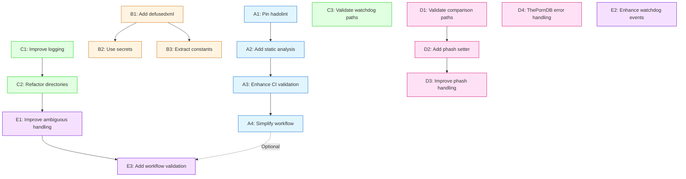

# Delivery Plan: `fix/ambiguity-review` Migration

## Overview

This document provides the execution roadmap for migrating 9 commits from `fix/ambiguity-review` into `main` via 16 atomic PRs organized into 5 parallel workstreams.

**Timeline:** 3 weeks
**Team Size:** 2-4 engineers
**Total PRs:** 16
**Parallel Capacity:** 4 concurrent PRs

---

## Dependency Graph



---

## Week-by-Week Execution Plan

### **Week 1: Foundation & Parallel Kickoff**

#### **Monday-Tuesday**

| Workstream | Engineer  | PR                            | Status   | Blocker |
| ---------- | --------- | ----------------------------- | -------- | ------- |
| **A**      | DevOps    | A1: Pin hadolint              | 🟢 Start | None    |
| **B**      | Backend-1 | B1: Add defusedxml            | 🟢 Start | None    |
| **C**      | Backend-2 | C1: Improve logging           | 🟢 Start | None    |
| **D**      | Backend-3 | D1: Validate comparison paths | 🟢 Start | None    |

**Daily Standup Focus:**

- Confirm cherry-pick strategy
- Validate test coverage
- Review PR templates

#### **Wednesday-Thursday**

| Workstream | Engineer  | PR                       | Status         | Blocker  |
| ---------- | --------- | ------------------------ | -------------- | -------- |
| **A**      | DevOps    | A2: Add static analysis  | 🟡 In Progress | A1 merge |
| **B**      | Backend-1 | B2: Use secrets          | 🟡 In Progress | B1 merge |
| **C**      | Backend-2 | C2: Refactor directories | 🟡 In Progress | C1 merge |
| **D**      | Backend-3 | D2: Add phash setter     | 🟡 In Progress | D1 merge |

**Merge Target:** A1, B1, C1, D1 by EOD Thursday

#### **Friday**

| Workstream | Engineer  | PR                          | Status         | Blocker         |
| ---------- | --------- | --------------------------- | -------------- | --------------- |
| **A**      | DevOps    | A3: Enhance CI validation   | 🟢 Start       | A2 merge        |
| **B**      | Backend-1 | B3: Extract constants       | 🟢 Start       | None (parallel) |
| **C**      | Backend-2 | C3: Validate watchdog paths | 🟢 Start       | None (parallel) |
| **D**      | Backend-3 | D3: Improve phash handling  | 🟡 In Progress | D2 merge        |

**Merge Target:** A2, B2, C2, D2 by EOD Friday

**🔴 Rollback Drill:**
After C2 merges, conduct a rollback test:
1. Create test branch: `git checkout -b rollback-test-c2 main`
2. Revert C2: `git revert -m 1 <c2-merge-sha>`
3. Verify C1 still functions: `poetry run pytest test/namer_test.py`
4. Document actual rollback time (target: <10 minutes)
5. Delete test branch: `git branch -D rollback-test-c2`
6. If rollback took >10 minutes, document issues in retrospective

---

### **Week 2: Feature Completion & CI Hardening**

#### **Monday-Tuesday**

| Workstream | Engineer  | PR                           | Status         | Blocker         |
| ---------- | --------- | ---------------------------- | -------------- | --------------- |
| **A**      | DevOps    | A4: Simplify workflow*       | 🟡 In Progress | A3 merge        |
| **B**      | Backend-1 | ✅ Complete                  | -              | -               |
| **C**      | Backend-2 | ✅ Complete                  | -              | -               |
| **D**      | Backend-3 | D4: ThePornDB error handling | 🟢 Start       | None (parallel) |
| **E**      | Backend-2 | E2: Enhance watchdog events  | 🟢 Start       | None (parallel) |

**Merge Target:** A3, B3, C3, D3 by EOD Tuesday

**⚠️ A4 Decision Point:**
Before starting A4, DevOps engineer must evaluate if the changes are still applicable:

**SKIP A4 if:**
- [ ] A2 and A3 already removed the exact lines A4 would delete
- [ ] Workflow file is <200 lines after A3 merge
- [ ] No duplicate job definitions exist in workflow

**PROCEED with A4 if:**
- [ ] Lines from commit `8e90cc3` still present in `.github/workflows/pr-validate.yml`
- [ ] Duplicate job steps identified (e.g., multiple lint/test definitions)
- [ ] Workflow file >250 lines after A3 merge

Document decision in A4 PR description or as GitHub discussion comment.

#### **Wednesday-Thursday**

| Workstream | Engineer  | PR                             | Status         | Blocker  |
| ---------- | --------- | ------------------------------ | -------------- | -------- |
| **A**      | DevOps    | ✅ Complete                    | -              | -        |
| **D**      | Backend-3 | ✅ Complete                    | -              | -        |
| **E**      | Backend-2 | E1: Improve ambiguous handling | 🟡 In Progress | C2 merge |

**Merge Target:** A4, D4, E2 by EOD Thursday

#### **Friday**

| Workstream | Engineer  | PR                          | Status   | Blocker  |
| ---------- | --------- | --------------------------- | -------- | -------- |
| **E**      | Backend-2 | E3: Add workflow validation | 🟢 Start | E1 merge |

**Merge Target:** E1 by EOD Friday

---

### **Week 3: Final Integration & Validation**

#### **Monday-Tuesday**

| Workstream | Engineer  | PR                          | Status         | Blocker  |
| ---------- | --------- | --------------------------- | -------------- | -------- |
| **E**      | Backend-2 | E3: Add workflow validation | 🟡 In Progress | E1 merge |

**Merge Target:** E3 by EOD Tuesday

#### **Wednesday-Friday: Integration Testing**

- Run full regression suite against `main`
- Validate all 16 PRs integrated correctly
- Monitor production metrics (if applicable)
- Document lessons learned

### **Smoke Test Checkpoints**

Execute these validation tests after merging sequential PRs to catch regressions early:

#### **After C2 Merges (Week 1 Friday)**

**Purpose:** Validate directory creation refactor works correctly

```bash
# Create test directory with sample videos
mkdir -p /tmp/namer-test-c2
cd /tmp/namer-test-c2

# Test directory creation with various structures
poetry run namer --help  # Verify tool loads
poetry run pytest test/namer_test.py test/command_test.py -v

# Manual test: Process a video and verify logs show enhanced directory context
# Look for improved error messages from C1+C2 changes
```

**Expected Results:**
- [ ] All directory creation tests pass
- [ ] Error messages include enhanced context (from C1)
- [ ] Directory utility function is used consistently (from C2)

#### **After D3 Merges (Week 2 Tuesday)**

**Purpose:** Validate phash handling improvements work end-to-end

```bash
# Run phash-specific tests
poetry run pytest test/stashdb_phash_ambiguity_test.py -v
poetry run pytest test/comparison_results_test.py -v

# Verify setter method is used
grep -r "set_phash_match_used" namer/
```

**Expected Results:**
- [ ] Phash ambiguity tests pass
- [ ] Setter method accessible and functional (D2)
- [ ] Phash result handling improved (D3)
- [ ] No regression in comparison result path handling (D1)

#### **After E1 Merges (Week 2 Friday)**

**Purpose:** Validate ambiguous file routing to new directory structure

```bash
# Test ambiguous file handling
mkdir -p /tmp/namer-test-e1

# Create test scenario with ambiguous match
# Process file and verify it routes to ambiguous directory
poetry run pytest test/namer_test.py -k ambiguous -v

# Verify new directory handling logic
grep -A5 "ambiguous" namer/namer.py
```

**Expected Results:**
- [ ] Files with ambiguous matches route to correct directory
- [ ] Directory creation uses refactored utility from C2
- [ ] No errors in ambiguous file processing
- [ ] Logs show improved ambiguous handling context

---

## Resource Allocation

### **Engineer Assignments**

| Engineer               | Primary Workstream | Backup Workstream | Estimated Hours |
| ---------------------- | ------------------ | ----------------- | --------------- |
| **DevOps Engineer**    | A (CI/CD)          | -                 | 20-25 hours     |
| **Backend Engineer 1** | B (Security)       | E (Ambiguity)     | 15-20 hours     |
| **Backend Engineer 2** | C (Refactoring)    | E (Ambiguity)     | 20-25 hours     |
| **Backend Engineer 3** | D (Features)       | -                 | 20-25 hours     |

### **Skill Requirements**

| Workstream | Required Skills                                            |
| ---------- | ---------------------------------------------------------- |
| **A**      | GitHub Actions, Docker, CI/CD pipelines                    |
| **B**      | Python security best practices, dependency management      |
| **C**      | Python refactoring, file I/O, logging                      |
| **D**      | Metadata processing, comparison logic, phash algorithms    |
| **E**      | File routing logic, watchdog patterns, integration testing |

---

## Daily Standup Template

### **Questions**

1. **Yesterday:** What PRs did you complete/progress?
2. **Today:** Which PR are you working on?
3. **Blockers:** Are you waiting on any merges?
4. **Conflicts:** Any merge conflicts encountered?

### **Metrics to Track**

- PRs opened vs. merged
- Average PR review time
- CI failure rate
- Merge conflict count

---

## PR Review Guidelines

### **Review Checklist**

- [ ] Source commit SHA documented in PR description
- [ ] Only relevant files staged (no accidental includes)
- [ ] Tests pass locally (`poetry run pytest`)
- [ ] Linting passes (`poetry run ruff check .`)
- [ ] No merge conflicts with `main`
- [ ] PR size ≤100 lines (excluding lock files)
- [ ] Related PRs linked in description

### **Review SLA**

- **Priority 1 (Blocking):** 4 hours
- **Priority 2 (Sequential):** 8 hours
- **Priority 3 (Parallel):** 24 hours

### **Approval Requirements**

- **CI/CD PRs (A-series):** 1 DevOps + 1 Backend approval
- **Security PRs (B-series):** 1 Security + 1 Backend approval
- **Code PRs (C/D/E-series):** 2 Backend approvals

---

## Merge Strategy

### **Branch Naming Convention**

```
<type>/<pr-id>-<short-description>

Examples:
- chore/a1-pin-hadolint-action
- fix/b2-use-secrets-for-temp-files
- refactor/c2-consolidate-directory-creation
- feat/e1-improve-ambiguous-handling
```

### **Commit Message Format**

```
<type>(<scope>): <subject>

<body>

Source: fix/ambiguity-review@<commit-sha>
Related: #<pr-number> (if dependent)
```

### **Merge Order Enforcement**

Use GitHub branch protection rules:

```yaml
# .github/branch-protection.yml
main:
  required_status_checks:
    - CI / Lint and Test
    - CI / Static Analysis
    - CI / Build Container
  required_approving_review_count: 2
  dismiss_stale_reviews: true
  require_code_owner_reviews: false
```

---

## Risk Management

### **High-Risk PRs**

| PR     | Risk                           | Mitigation                            |
| ------ | ------------------------------ | ------------------------------------- |
| **C2** | Refactors core directory logic | Extensive unit tests; manual QA       |
| **E1** | Changes ambiguous file routing | Integration tests; staging deployment |
| **A3** | Adds new CI dependencies       | Gradual rollout; rollback plan        |

### **Rollback Procedures**

#### **Individual PR Rollback**

```bash
# Identify merge commit
git log --oneline --merges main | grep "<pr-title>"

# Revert merge
git revert -m 1 <merge-commit-sha>
git push origin main
```

#### **Coordinated Rollback (C1+C2)**

```bash
# Revert in reverse order
git revert -m 1 <c2-merge-sha>
git revert -m 1 <c1-merge-sha>
git push origin main
```

### **Hotfix Protocol**

If a critical bug is discovered mid-migration:

1. Pause all in-progress PRs
2. Create `hotfix/<issue>` branch from `main`
3. Fix and merge hotfix
4. Rebase all open PR branches on updated `main`
5. Resume migration

---

## Communication Plan

### **Slack Channels**

- **#migration-ambiguity-review:** Daily updates, blockers
- **#pr-reviews:** Review requests
- **#ci-alerts:** CI failure notifications

### **Real-Time Blocker Protocol**

**When a blocking PR is delayed:**

1. Engineer posts in `#migration-ambiguity-review`:
   ```
   ⏸️ [Workstream X] PR X delayed - ETA +2 days
   Reason: [merge conflicts/review delay/CI issues/etc.]
   Impact: Blocks [list affected PRs]
   ```

2. **Blocked engineer actions:**
   - Switch to parallel work in same workstream (if available)
   - Assist with resolving the blocker
   - Start preparation work for blocked PR (read code, write tests)

3. **Project manager updates:**
   - Update dependency timeline in GitHub Projects
   - Notify affected workstream engineers
   - Adjust weekly targets if needed

**Escalation Threshold:** Any PR >1 day past merge target triggers:
- Immediate sync between PR author and reviewers
- Resource reallocation discussion
- Risk assessment update

**Example Escalation Flow:**
```
Day 1: A2 scheduled to merge by EOD
Day 2 AM: A2 still in review → Engineer posts blocker
Day 2 PM: PM schedules sync with reviewers
Day 3: If still blocked → Reassign reviewer or simplify PR scope
```

### **Weekly Sync**

**When:** Fridays 2pm
**Agenda:**

1. Week recap (PRs merged, blockers resolved)
2. Next week preview (upcoming PRs, dependencies)
3. Risk review (conflicts, delays)
4. Lessons learned

### **Status Dashboard**

Track progress in GitHub Projects:

- **Columns:** Backlog, In Progress, In Review, Merged
- **Labels:** `workstream-a`, `workstream-b`, etc.
- **Milestones:** Week 1, Week 2, Week 3

---

## Success Criteria

### **Completion Metrics**

- ✅ All 16 PRs merged into `main`
- ✅ Zero production incidents caused by migration
- ✅ CI green on `main` after final merge
- ✅ Test coverage ≥80% maintained
- ✅ No merge conflicts during execution

### **Quality Metrics**

- Average PR size: ≤100 lines
- Average review time: ≤8 hours
- CI failure rate: ≤10%
- Rollback count: 0

### **Timeline Metrics**

- Week 1: 8 PRs merged (50%)
- Week 2: 6 PRs merged (87.5%)
- Week 3: 2 PRs merged (100%)

---

## Post-Migration Tasks

### **Cleanup**

- [ ] Archive `fix/ambiguity-review` branch
- [ ] Update documentation with new patterns
- [ ] Create runbook for ambiguous file handling
- [ ] Schedule retrospective meeting
- [ ] Schedule and conduct a "Migration Debrief & Knowledge Transfer" session for the engineering team.

### **Monitoring**

- [ ] Monitor error rates for 1 week post-merge
- [ ] Track ambiguous file routing metrics
- [ ] Validate CI performance (no slowdowns)

### **Knowledge Transfer**

- [ ] Document new directory creation utility
- [ ] Update onboarding docs with security patterns
- [ ] Share lessons learned in team wiki

---

## Appendix: Quick Reference

### **Cherry-Pick Command**

```bash
git checkout -b <branch-name> origin/main
git cherry-pick -n <commit-sha>
git reset HEAD  # Unstage all
git add <specific-files>
git commit -m "<commit-message>"
git push origin <branch-name>
```

### **Conflict Resolution**

```bash
# If merge conflict occurs
git fetch origin main
git rebase origin/main

# Resolve conflicts in editor
git add <resolved-files>
git rebase --continue
git push --force-with-lease origin <branch-name>
```

### **Emergency Contacts**

- **DevOps Lead:** @devops-lead (Workstream A)
- **Security Lead:** @security-lead (Workstream B)
- **Backend Lead:** @backend-lead (Workstreams C/D/E)
- **Project Manager:** @pm (Overall coordination)

---

**Document Version:** 1.0
**Last Updated:** 2025-10-06
**Next Review:** End of Week 1
**Maintained By:** Project Manager
